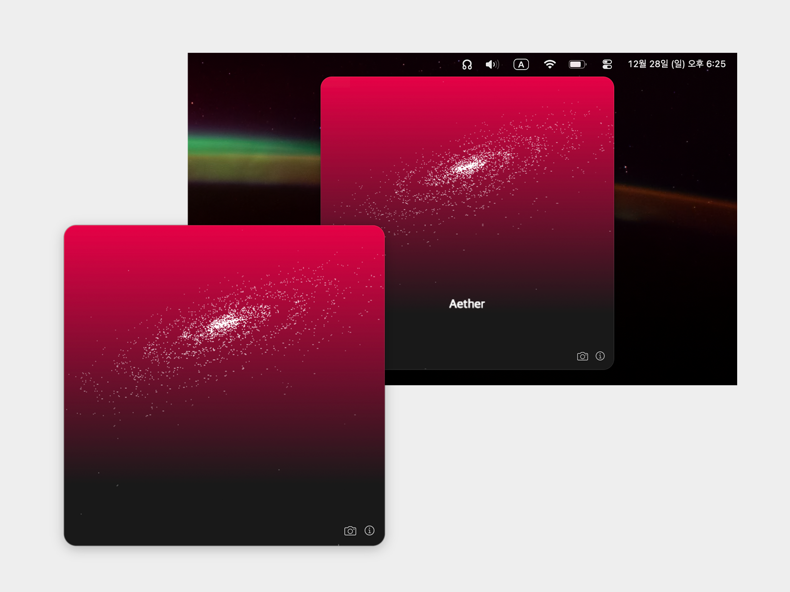

# ☊ Aether ☊


[](https://github.com/damagethundercat/Aether/raw/main/Aether_Installer.dmg)


안녕하세요, 2026년 병오년을 맞이하며 연하장을 배포합니다. 

이곳 지구로부터 약 1,500광년이 떨어진 오리온 자리 어딘가에도 거대한 붉은 말이 있습니다. 
바로 말머리 성운인데요, 그곳까지 소원이 닿길 바라는 마음으로 앱을 만들었습니다.

이 앱을 설치하고 실행하면 상단바에 떠있는 ☊ 아이콘을 찾아주세요!





## 주요 기능

* **상단바 내장 앱**: 별도의 실행 창이 존재하지 않습니다. 상단바에 있는 아이콘을 눌러 플로팅되는 화면을 확인해주세요.
* **회전하는 은하**: 말머리 성운의 유명한 이미지에서 따온 붉은 색조의 배경 위에 하얀 파티클로 이루어진 은하가 천천히 회전합니다.
* **텍스트 입력과 전송**: 소원, 다짐, 혹은 무언가..를 입력하고 엔터로 보내보세요. 글자들은 조각으로 흩어지고 은하로 날아갑니다.
* **허공으로**: 엔터를 누르고 글자가 날아가는 동안, 실제로 그 글은 암호화된 신호가 되어 로컬 네트워크의 허공('255.255.255.255')으로 영원히 방출됩니다. 언젠간 말머리 성운에 닿을 수 있지 않을까요?
* **이?스터에그**: 앱 정보 창에는 개발자인 제가 보내는 작은 연하장이 있습니다. 새해 복 많이 받으세요.


## 설치 및 실행 방법

Aether는 App Store를 거치지 않은 인디 앱입니다. 최초 실행 시 macOS 보안 설정에 대한 허용이 필요합니다.

1.  위의 **Download** 버튼을 눌러 `Aether.dmg`를 받습니다.
2.  파일을 열고 **Aether** 아이콘을 **Applications** 폴더로 드래그합니다.
3.  앱을 처음 실행할 때, 아이콘을 마우스 우클릭 한 뒤 **열기**를 눌러주세요.
4.  보안 관련 경고가 발생할 경우, 환경설정 -> 개인정보 보호 및 보안 -> 경고 로그 옆 **확인 없이 열기**를 클릭해 실행해주세요.

---

<details>
<summary><b>개발자 및 기여자를 위한 정보</b></summary>

### Tech Stack
* **Swift (AppKit)**: Native macOS Experience & Networking
* **p5.js & WKWebView**: Particle System & Visuals

### How to Build
Xcode 프로젝트 파일 없이 터미널만으로 빌드가 가능합니다.

**필수 조건**: macOS 11.0+, Swift 5.x (Xcode Command Line Tools)

1.  **Clone**
    ```bash
    git clone [https://github.com/damagethundercat/Aether.git](https://github.com/damagethundercat/Aether.git)
    cd Aether/WishcasterSwift
    ```

2.  **Build & Run**
    ```bash
    ./build_app.sh   # 빌드 (Aether.app 생성)
    open Aether.app  # 실행
    ```

</details>

Aether는 모든 소스 코드가 투명하게 공개된 **100% 오픈소스 프로젝트**입니다. 악성 코드나 바이러스 걱정 없이 안전하게 사용하실 수 있습니다.

## 라이선스
MIT License. 자유롭게 수정하고 사용하세요.
